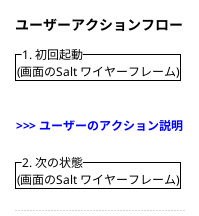

# Screen Flow - 機能 → 画面落とし込みスキル

## コンセプト

「機能ができた！でもどんな画面にすればいいかわからない」を解決する。
AI が全部決めるのではなく、**ワイヤーフレームを見ながらユーザーと一緒に詰めていく**。

## 入力

以下のいずれかを入力として受け取る：
- design-discussion の成果物（`.claude/design_discussion/sessions/<name>/`）
- feature-discussion の成果物
- ユーザーからの直接の機能説明（ある程度詳細なもの）

**入力の粒度**: 「タスクをカンバン形式で管理。ラベル・期限・担当者あり」程度の詳細さが必要。
曖昧な場合はユーザーに補足質問する。

## 出力

```
.claude/ui_flow_design/sessions/<session-name>/
├── workflow-state.json           ← プロセス状態管理（2ステップ）
├── 01_user-action-flow.md        ← ステップ1: ユーザーアクションフロー（テキスト）
├── 01_state-diagram.puml         ← ステップ1: アクションフロー（Salt ワイヤーフレーム版）
├── 02_screen-info.md             ← ステップ2: 画面設計ノート（議事録形式）
└── 02_full-layout.puml           ← ステップ2: 全画面ワイヤーフレーム（1枚に統合）
```

### ファイル分離ルール

- **PlantUML 図は `.puml` ファイルに切り出す**（Cursor でプレビュー可能にするため）
- `.md` には説明テキストと `.puml` への参照だけ書く
- `.md` 内に PlantUML コードブロックを埋め込まない

### 連動更新ルール

画面仕様を修正した場合、以下のファイルを **必ず連動して更新** する：
- `01_user-action-flow.md` のフロー説明
- `01_state-diagram.puml` のワイヤーフレーム版フロー
- `02_screen-info.md` の設計ノート
- `02_full-layout.puml` の全画面ワイヤーフレーム

1つだけ更新して他を放置しない。

---

## 2ステップのプロセス

### ステップ1: ユーザーアクションフロー
**出力**: `01_user-action-flow.md` + `01_state-diagram.puml`
**前提**: 入力ファイル（design-discussion 成果物 or 機能説明）

1. 入力ファイルを読み、情報が足りなければユーザーに質問する
2. ユーザーの行動フローを整理（正常系 + 異常系）
3. テキスト説明を `01_user-action-flow.md` に出力
4. **Salt ワイヤーフレーム版のアクションフロー**を `01_state-diagram.puml` に出力
   - 各ステップの画面状態を Salt で表現し、操作の流れがわかるようにする
   - 1枚の Salt 図に全ステップを縦に並べ、ステップ間にアクション説明を挟む
5. ユーザーに確認を求める
6. OK なら workflow-state.json を `completed` に更新

#### 01_state-diagram.puml の形式



### ステップ2: 画面設計・ワイヤーフレーム
**出力**: `02_full-layout.puml` + `02_screen-info.md`
**前提**: ステップ1 が completed

**ワイヤーフレームファースト**のアプローチ：
1. まず `02_full-layout.puml` で全画面のワイヤーフレームを作る
2. ユーザーにワイヤーフレームを見せる
3. ワイヤーフレームを見ながら一緒に詰めていく
   - 「この要素いる？」「ここにこの機能を追加して」等のフィードバック
4. 決まったことを `02_screen-info.md` に議事録形式で記録
5. フィードバックに応じてワイヤーフレームを更新 → 再度確認 → 記録を繰り返す

#### doc-sync エージェントの非同期起動

`.puml` ファイルを更新した後、**必ず doc-sync エージェントを `run_in_background: true` で起動**する。
メインの作業（ユーザーとのやりとり）を止めずに、バックグラウンドで .md を同期更新させる。

```
Agent(
  subagent_type: "ui-flow-design:doc-sync",
  run_in_background: true,
  prompt: "02_full-layout.puml が更新されました。02_screen-info.md を同期してください。"
)
```

#### 02_full-layout.puml の構成ルール

- **1枚の Salt 図に全画面要素をまとめる**
- メイン画面（全体レイアウト）を上部に配置
- 画面の状態バリエーション（モード切替等）は横並びで表示
- コンポーネント詳細（ドロップダウン展開時等）は下部に配置
- 各画面要素間に十分なスペーサーを入れる

#### 02_screen-info.md の構成

議事録形式で、以下を随時追記していく：
- **レイアウト方針**: 全体のレイアウト構成
- **各画面要素の仕様**: 表示情報・インタラクション・入力
- **不採用にしたもの**: 検討したが不要と判断した機能とその理由
- **異常系**: エラー状態と回復手段
- **未解決課題**: まだ決まっていないこと

---

## PlantUML Salt の注意事項

**plantuml-salt スキルを参照して正確な Salt 記法を使う。**

Critical Rules:
1. `} | {` は絶対に1行で書く
2. テーブルの列数は全行で統一する
3. ネストの `}` の対応を必ず確認する
4. ドロップダウンの `^` は必ずペアで閉じる
5. `!theme` ディレクティブはCursor互換性のため使わない

---

## ワークフロー状態管理

`workflow-state.json` でプロセスの状態を管理する：

```json
{
  "meta": {
    "app": "アプリ名",
    "sessionId": "セッションID",
    "createdAt": "日付",
    "updatedAt": "日付",
    "sourceFiles": ["入力ファイルのパス"]
  },
  "steps": [
    {
      "id": 1,
      "name": "ユーザーアクションフロー",
      "status": "pending | in_progress | completed | needs_revision",
      "outputFiles": ["01_user-action-flow.md", "01_state-diagram.puml"],
      "iterations": [
        {
          "round": 1,
          "generatedAt": "日付",
          "userFeedback": "ユーザーからのフィードバック or null",
          "approved": false
        }
      ]
    },
    {
      "id": 2,
      "name": "画面設計・ワイヤーフレーム",
      "status": "pending | in_progress | completed | needs_revision",
      "outputFiles": ["02_full-layout.puml", "02_screen-info.md"],
      "iterations": []
    }
  ],
  "currentStep": 1,
  "decisions": []
}
```

## 既存スキルとの連携

- **design-discussion** の成果物を自動読み込み
- **feature-discussion** の成果物があれば参照
- **plantuml-salt** スキルをワイヤーフレーム生成時に参照
- ペルソナ・トンマナファイルがあれば自動で反映

## ディレクトリ構造

```
.claude/ui_flow_design/sessions/<session-name>/
```

セッション名は design-discussion と合わせると紐付けが明確になる。
