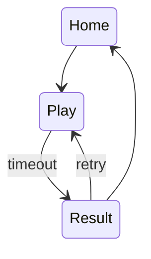

# <App name> — Frozen requirements

## One-line promise

## Persona and job

## Primary success metric

## Constraints

## Three-screen map

## Rules and state

### Persistence schema

### Time, timeout, failure, penalty, and reset

### Deterministic demo state

## Devil's advocate

| Risk | Severity | Decision |
|---|---|---|

## Acceptance tests

- Given / When / Then

## Scope

- Must:
- Later:
- Never in live demo:

## Scope lock

SCOPE LOCKED.
