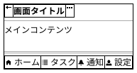

# PlantUML Salt ベストプラクティス

## Critical Rules

Salt 図を生成する前に必ず守るべきルール。これを守らないとパースエラーやレイアウト崩れが起きる。

### 1. `} | {` は絶対に1行で書く

横並びパネルの区切り `} | {` を改行すると壊れる。

```
NG:
}
|
{

OK:
  } | {
```

### 2. テーブルの列数は全行で統一する

```
NG:
{#
  名前 | 値
  A | B | C
}

OK:
{#
  名前 | 値 | 備考
  A    | B  | C
}
```

### 3. ネストの `}` の対応を必ず確認する

1つでもずれると全体が壊れる。インデントで可読性を確保すること。

### 4. ドロップダウンの `^` は必ずペアで閉じる

```
NG: ^値^項目1^項目2
OK: ^値^項目1^項目2^
```

### 5. 外枠 `{+` を使うとモバイル画面っぽくなる

モバイルアプリのワイヤーフレームには `{+` を基本にする。

## コンポーネントとレイアウト

全コンポーネント一覧、レイアウト修飾子、セパレータの詳細は
[references/syntax-guide.md](references/syntax-guide.md) を参照。

主要なもの:
- ボタン: `[ラベル]`
- テキスト入力: `"テキスト   "`（末尾スペースで幅調整）
- ドロップダウン: `^値^`（閉）/ `^選択値^項目1^項目2^`（開）
- チェックボックス: `[ ] OFF` / `[X] ON`
- ラジオボタン: `() OFF` / `(X) ON`
- アイコン: `<&person>` `<&home>` `<&magnifying-glass>` 等（OpenIconic）

## レイアウト修飾子早見表

| 記法 | 用途 |
|---|---|
| `{` | 縦並び（デフォルト） |
| `{+` | 外枠付き |
| `{#` | 全罫線テーブル |
| `{!` | 縦線のみ |
| `{-` | 横線のみ |
| `{/` | タブ |
| `{*` | メニューバー |
| `{T` | ツリー |
| `{^"名前"` | グループボックス（カード風） |
| `{S` | スクロールバー |

## モバイルアプリ向けパターン

モバイル画面の具体的なパターン集は
[references/mobile-patterns.md](references/mobile-patterns.md) を参照。

基本構成は「ナビバー + メインコンテンツ + ボトムタブ」の3層:



## 画面遷移フロー

アクティビティ図に Salt を埋め込んで画面遷移フローを表現できる。
詳細は [references/flow-patterns.md](references/flow-patterns.md) を参照。

## Workflow

1. 生成前にこのスキルの Critical Rules を確認する
2. 必要なコンポーネントを `references/syntax-guide.md` から選ぶ
3. モバイルアプリの場合は `references/mobile-patterns.md` のパターンを使う
4. 画面遷移を表現する場合は `references/flow-patterns.md` を参照する
5. 生成後、Critical Rules の5項目を再チェックする
