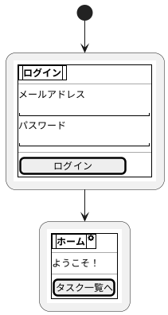
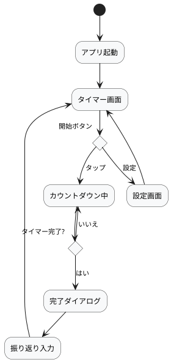
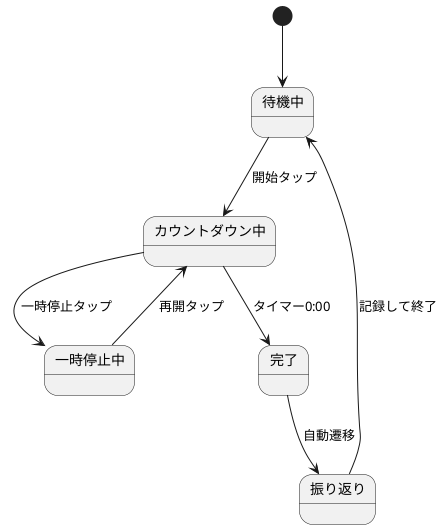

# 画面遷移フローパターン

## アクティビティ図への Salt 埋め込み

画面遷移を表現するとき、アクティビティ図に Salt を埋め込める。

```plantuml
@startuml
(*) --> "
{{
salt
{+
  {# . | **ログイン** | . }
  --
  メールアドレス
  "                    "
  パスワード
  "                    "
  --
  [      ログイン      ]
}
}}
" as login

login --> "
{{
salt
{+
  {# . | **ホーム** | <&cog> }
  --
  ようこそ！
  --
  [タスク一覧へ]
}
}}
" as home

@enduml
```

---

## シンプルなフローチャート（Salt なし）

画面遷移の全体像を俯瞰するにはシンプルなアクティビティ図が有効。

```plantuml
@startuml
skinparam backgroundColor transparent
skinparam activityBackgroundColor #f8f9fa
skinparam activityBorderColor #333333

(*) --> "アプリ起動"
--> "タイマー画面"

if "開始ボタン" then
  -->[タップ] "カウントダウン中"
  --> if "タイマー完了?" then
    -->[はい] "完了ダイアログ"
    --> "振り返り入力"
    --> "タイマー画面"
  else
    -->[いいえ] "カウントダウン中"
  endif
else
  -->[設定] "設定画面"
  --> "タイマー画面"
endif

@enduml
```

---

## 状態遷移図

画面の状態変化を表現するのに適している。

```plantuml
@startuml
[*] --> 待機中
待機中 --> カウントダウン中 : 開始タップ
カウントダウン中 --> 一時停止中 : 一時停止タップ
一時停止中 --> カウントダウン中 : 再開タップ
カウントダウン中 --> 完了 : タイマー0:00
完了 --> 振り返り : 自動遷移
振り返り --> 待機中 : 記録して終了
@enduml
```
