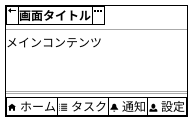
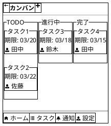
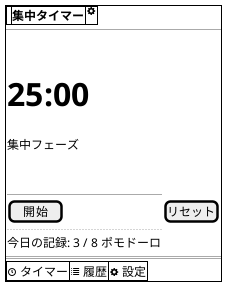

# モバイルアプリ向け Salt パターン集

## 基本画面構成（3層）



---

## ナビゲーションバー

```plantuml
{#
  <&arrow-left> | **タイトル** | <&ellipses>
}
```

戻るボタンなし（ルート画面）:

```plantuml
{#
  . | **タイトル** | <&cog>
}
```

---

## リスト表示

### セパレータ区切り

```plantuml
{
  <&person> ユーザー名1 -- 説明テキスト
  --
  <&person> ユーザー名2 -- 説明テキスト
  --
  <&person> ユーザー名3 -- 説明テキスト
}
```

### 罫線区切り（詳細付き）

```plantuml
{-
  <&person> ユーザー名1 | 詳細テキスト | >
  <&person> ユーザー名2 | 詳細テキスト | >
  <&person> ユーザー名3 | 詳細テキスト | >
}
```

---

## カード表示

### 縦並び

```plantuml
{
  {^"タスク: 設計書作成"
    期限: 2026/03/20
    担当: 田中
    [詳細を見る]
  }
  {^"タスク: API実装"
    期限: 2026/03/25
    担当: 佐藤
    [詳細を見る]
  }
}
```

### 横並び

```plantuml
{
  {^"カード1"
    内容A
    [アクション]
  } | {^"カード2"
    内容B
    [アクション]
  }
}
```

---

## ボトムタブバー

テキスト付き:

```plantuml
{#
  <&home> ホーム | <&list> タスク | <&bell> 通知 | <&person> 設定
}
```

ボタン風:

```plantuml
{
  [<&home>] | [<&list>] | [<&bell>] | [<&person>]
}
```

---

## モーダル/ダイアログ

```plantuml
{^"確認"
  このタスクを削除しますか？
  --
  [キャンセル] | [  削除  ]
}
```

---

## フォーム

```plantuml
{+
  {#
    <&arrow-left> | **タスク作成** | .
  }
  --
  {
    タスク名
    "                              "
    ..
    説明
    {SI
      "                            "
      "                            "
      "                            "
    }
    ..
    優先度
    ^中^高^中^低^
    ..
    期限
    "2026/03/20"
    ..
    担当者
    ^田中^田中^佐藤^鈴木^
    ..
    ラベル
    [X] バグ
    [ ] 機能追加
    [ ] 改善
    --
    [        保存        ]
  }
}
```

---

## カンバンボード



---

## タイマー画面（ポモドーロ等）


