# PlantUML Salt Syntax Guide - Full Reference

## 基本構文

```plantuml
@startsalt
{
  内容
}
@endsalt
```



- 最外殻は必ず `{` `}` で囲む
- `{}` はネスト可能（サブパネルになる）

---

## コンポーネント一覧

| コンポーネント | 記法 | 例 |
|---|---|---|
| テキスト | そのまま書く | `タスク一覧` |
| ボタン | `[ラベル]` | `[保存]` |
| テキスト入力 | `"テキスト   "` | `"タスク名を入力   "` |
| ドロップダウン（閉） | `^値^` | `^選択してください^` |
| ドロップダウン（開） | `^選択値^項目1^項目2^` | `^高^高^中^低^` |
| チェックボックス OFF | `[ ] ラベル` | `[ ] 完了` |
| チェックボックス ON | `[X] ラベル` | `[X] 完了` |
| ラジオボタン OFF | `() ラベル` | `() オプションA` |
| ラジオボタン ON | `(X) ラベル` | `(X) オプションA` |

### テキスト装飾

```
**太字**
//斜体//
""モノスペース""
--打消し線--
__下線__
<color:Blue>青文字</color>
<size:20>大きな文字</size>
```

### アイコン（OpenIconic）

```
<&person>    人           <&home>      ホーム
<&magnifying-glass>  検索  <&bell>      通知
<&cog>       設定         <&arrow-left>  戻る
<&plus>      追加         <&trash>     削除
<&pencil>    編集         <&check>     チェック
<&circle-check>  チェック丸  <&circle-x>  バツ丸
<&clock>     時計         <&list>      リスト
<&menu>      メニュー     <&ellipses>  三点リーダー
<&folder>    フォルダ     <&key>       鍵
<&people>    グループ
```

---

## レイアウト制御

### 縦並び（デフォルト）

```plantuml
{
  要素A
  要素B
  要素C
}
```

### 横並び（`|` パイプ区切り）

**重要: `} | {` は必ず1行に書くこと。**

```plantuml
{
  {
    左パネル
  } | {
    右パネル
  }
}
```

3列:

```plantuml
{
  {
    左
  } | {
    中
  } | {
    右
  }
}
```

### グリッド/テーブル修飾子

| 記法 | 罫線 |
|---|---|
| `{` | なし |
| `{+` | 外枠のみ |
| `{#` | 全罫線 |
| `{!` | 縦線のみ |
| `{-` | 横線のみ |

テーブル例:

```plantuml
{#
  .         | タスク名   | 期限       | 担当者
  1         | 設計       | 03/20      | 田中
  2         | 実装       | 03/25      | 佐藤
}
```

- `.` は空セル
- `*` はセルスパン（左セルと結合）
- **全行で列数を揃えること**

### タブ `{/`

```plantuml
{/
  <b>すべて | 進行中 | 完了
  --
  タブ内コンテンツ
}
```

### メニューバー `{*`

```plantuml
{*
  File | Edit | View | Help
}
```

### ツリー `{T`

```plantuml
{T
  + プロジェクト
  ++ フロントエンド
  +++ React
  ++ バックエンド
  +++ API
}
```

### グループボックス `{^`

```plantuml
{^"グループ名"
  内容1
  内容2
}
```

### スクロールバー `{S`

| 記法 | 方向 |
|---|---|
| `{S` | 縦横両方 |
| `{SI` | 縦のみ |
| `{S-` | 横のみ |

### セパレータ

| 記法 | 表示 |
|---|---|
| `--` | 実線 |
| `==` | 二重線 |
| `..` | 点線 |
| `~~` | 波線 |

---

## 幅の制御

Salt にはカラム幅指定がない。テキスト入力のスペースで間接的に調整する。

```
狭い: "名前"
広い: "名前                    "
```

---

## 生成時チェックリスト（AI向け）

1. `} | {` は1行で書いたか？
2. テーブルの列数は全行で統一されているか？
3. 外枠 `{+` を使っているか？（モバイル画面の場合）
4. ネストの `}` は全て対応しているか？
5. グループボックス `{^"名前"` でカード風UIを表現しているか？
6. 幅調整はテキスト入力 `"   "` のスペース量で行っているか？
7. アイコンは OpenIconic `<&icon-name>` を使っているか？
8. セパレータ `--` `==` `..` で区切りをつけているか？
9. ドロップダウンの `^` は偶数個になっているか？
10. モバイル画面は「ナビバー + メインコンテンツ + ボトムタブ」の3層構成か？
