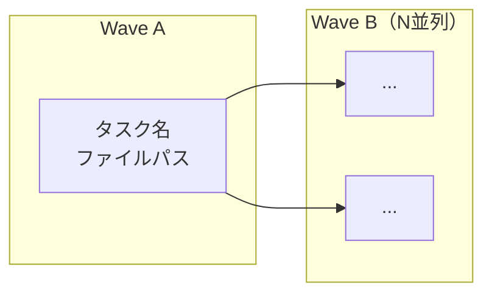

# Parallel Task Planner

実装計画をタスクに分解し、**編集ファイルが被らないタスクを全て並列化**する。
成果物はディレクトリ分割された TODO ファイル群 + Mermaid 依存関係図。

## インプット

以下のいずれか（またはユーザーに質問して収集）:

- 実装計画書（implementation-plan.md 等）
- 設計ドキュメント（アーキテクチャ図、クラス図等）
- team-plan の出力（Plan Mode の計画書）
- ユーザーからの口頭説明

## アウトプット

```
docs/tasks/{date}_{task-name}/
├── todo.md                          ← 全体サマリー + Wave 並列マップ
├── implementation-plan.md           ← 設計書（あれば同梱）
├── 01_{group-name}/todo.md          ← 高レベル TODO 1 の詳細
├── 02_{group-name}/todo.md          ← 高レベル TODO 2 の詳細
├── ...
└── NN_{group-name}/todo.md
```

---

## Step 1: タスクの洗い出し

### 1a: 設計書の読み込み

ユーザーが指定した設計書・計画書を Read する。
なければユーザーにヒアリングして情報を集める。

### 1b: 高レベル TODO の特定

実装を**大きな塊**に分ける。分け方の基準:

- **ディレクトリの境界**: `packages/shared/`, `apps/api/src/core/`, `apps/web/src/` etc.
- **レイヤーの境界**: 型定義 → ロジック → インフラ → API → UI
- **独立性**: 他のタスクと依存しない塊は独立させる

### 1c: 細かいタスクへの分解

各高レベル TODO を具体的なタスクに分解する。各タスクに必ず以下を付記:

- **編集ファイル**: 実際に作成・変更するファイルパス
- **依存先**: このタスクの前に完了していなければならないタスク
- **依存理由**: なぜ依存するか（型を import する、スキーマが必要、etc.）

---

## Step 2: 依存関係の分析

### 2a: ファイル単位の依存チェック

全タスクのペアについて、以下をチェック:

1. **編集ファイルが重複するか?** → 重複あれば同時実行不可
2. **import 依存があるか?** → タスク A の出力をタスク B が import するなら A → B の順
3. **どちらにも該当しないか?** → 並列実行可能

### 2b: 依存グラフの構築

タスク間の依存関係を有向グラフとして構築する。

```
例:
  shared-types → core (型を import)
  shared-types → stores (型を import)
  db-schema → db-shell (スキーマが必要)
  core + db-shell + cli → orchestrator (全部を合成)
```

### 2c: 並列グルーピングのルール

**原則: 編集ファイルが被らなければ同時実行**

具体的なチェック項目:
- 同じ `.ts` / `.tsx` ファイルを編集しないか
- 同じ `package.json` に依存を追加しないか（これは Wave A でまとめて解決）
- import 先がまだ存在しない場合、先に作る必要があるか

---

## Step 3: Wave への割り当て

### 3a: トポロジカルソート

依存グラフをトポロジカルソートし、依存のないタスクから順に Wave に割り当てる。

```
Wave N のルール:
  - Wave N-1 の全依存タスクが完了済み
  - Wave N 内のタスク同士は編集ファイルが被らない
  - 可能な限り多くのタスクを同じ Wave に詰める（並列最大化）
```

### 3b: Wave 割り当てアルゴリズム

```
1. 全タスクの依存カウントを計算
2. 依存カウント = 0 のタスクを Wave 1 に入れる
3. Wave 1 のタスクを「完了」として依存カウントを更新
4. 新たに依存カウント = 0 になったタスクを Wave 2 に入れる
5. Wave 内でファイル重複がある場合は、片方を次の Wave に送る
6. 全タスクが Wave に割り当てられるまで繰り返す
```

### 3c: 前倒し最適化

依存関係が解消されたタスクは、次の Wave を待たずに即座に開始可能と明記する。
例: Wave C のタスクの依存が Wave B の一部だけなら、その一部が終わった時点で開始可。

---

## Step 4: TODO ファイルの生成

### 4a: ディレクトリ作成

```bash
docs/tasks/{YYYY-MM-DD}_{task-name}/
```

今日の日付 + タスクの概要名でディレクトリを作る。

### 4b: 全体 todo.md

以下を含む:

```markdown
# TODO: {タスク名}

> 元のタスク: {ユーザーの指示}
> 設計ドキュメント: [implementation-plan.md](implementation-plan.md)

## 進捗サマリー
- 総タスク数: N
- 完了: 0
- レビュー済み: 0/M

## 高レベル TODO 一覧

| # | タスク | 状態 | タスク数 | 詳細 |
|---|--------|------|---------|------|
| 1 | ... | [ ] 未着手 | N | [01_.../](01_.../) |

## 依存関係 + 並列実行マップ

{Mermaid graph}

### Wave 詳細

| Wave | 並列タスク | 待ち |
|------|-----------|------|
| A | ... | - |
| B | ... / ... / ... | A |
```

### 4c: 各高レベル TODO の todo.md

各サブディレクトリに詳細な todo.md を作成:

```markdown
# N. {タスク名}

- **状態**: [ ] 未着手
- **概要**: ...
- **並列グループ**: Wave X で {他のタスク} と同時実行

## TODO

- [ ] N-1: {内容}（{ファイルパス}）
  - 依存: {依存先タスク}
  - {詳細な説明}

## 成果物

{生成されるファイル一覧}
```

### 4d: Mermaid 依存関係図

Wave ごとにサブグラフを作り、タスク間の矢印で依存を表現:



---

## Step 5: ユーザー確認

生成した TODO を提示し、以下を確認:

- Wave の並列グルーピングに違和感がないか
- 漏れているタスクがないか
- 優先順位を変えたい部分がないか

修正があれば反映して再出力する。

---

## 注意事項

### 並列最大化の原則

- **「このファイルはまだない」は依存ではない**: import する型が別タスクで作られる場合のみ依存
- **package.json の編集**: 依存パッケージの追加は Wave A（基盤セットアップ）でまとめて行い、以降の Wave では触らない
- **テストは実装と並列可**: テスト対象と別ファイルなら、実装完了直後の Wave で他タスクと並列実行できる

### long-run-implement との連携

この Skill の出力は long-run-implement のインプットとしてそのまま使える:
- `todo.md` の形式が互換
- Wave の順序 = long-run-implement の高レベル TODO の実行順序
- レビューゲートは高レベル TODO 単位で実施

### team-implement との連携

Wave の並列タスクは team-implement の Agent 並列実行にそのままマッピングできる:
- Wave 内の各タスク = 1 Agent
- Wave の完了 = 次の Wave の Agent 起動条件
